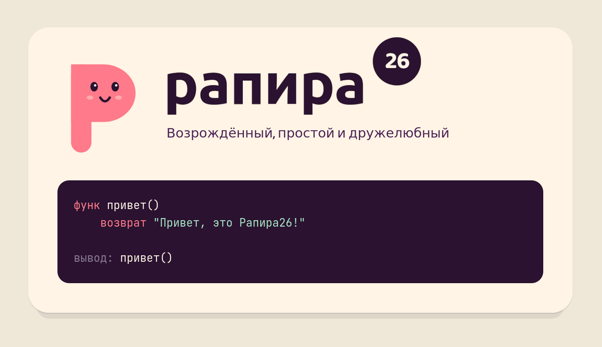

<p>&nbsp;</p>

<p align="center"><b>Рапира26</b> - это модернизированная, простая и дружелюбная версия языка "Рапира"</p>
<p align="center">А <b>рапик</b> - это "рапиры компилятор"</p>

---

## Как пользоваться?

Собери проект:
```
git clone https://gitflic.ru/project/artjom/rapira26
cd rapira26
# Получить бинарник в target/release/rapira26
cargo build --release
# Или если хочется установить на уровне системы
cargo install --path .
```

Запусти пример:
```
~/Projects/rapira26  =>  target/release/рапик --запуск doc/привет.рап
Привет, это Рапира26!
```

## Примеры кода

На данный момент примеры кода можешь посмотреть в `test/examples`, но когда-нибудь я сделаю тур, обещаю...

## История

Если интересно почему и зачем создавалась рапира26, можешь посмотреть:
- Старый [РИМДИ](doc/PROJECT.md)
- Первый [блогпост про рапиру](https://dacsson.github.io/blog/posts/2026-03-20-rapira-26-factorial.html)

## Использование ИИ 

В разработке активно использовался Claude Code Opus 4.6. К примеру многие тесты на языке "Рапира" были сгенерированны ИИ на основе препринта, а также лексер и парсер по большей части.
