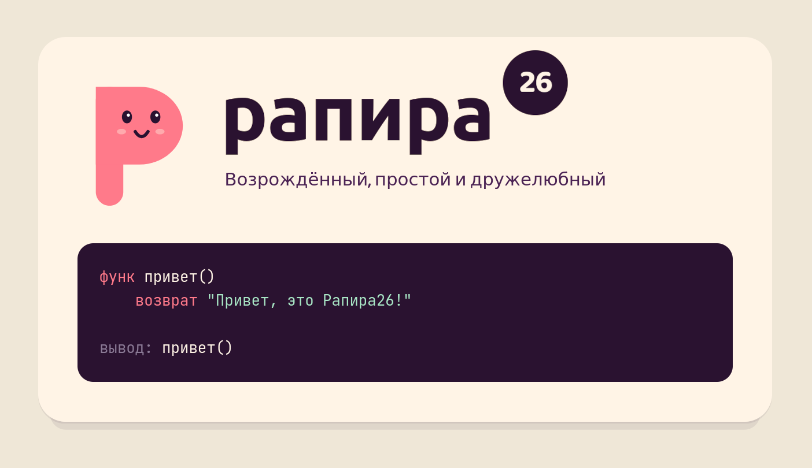

<p>&nbsp;</p>

<p align="center"><b>Рапира26</b> - это модернизированная, простая и дружелюбная версия языка "Рапира"</p>
<p align="center">А <b>рапик</b> - это "рапиры компилятор"</p>

---

> [!TIP]
> Попробовать язык можно прямо в браузере - [песочница](https://dacsson.github.io/rapira26-playground/)

## Как пользоваться?

Собери проект:
```
git clone https://gitflic.ru/project/artjom/rapira26
cd rapira26
# Получить бинарник в target/release/rapira26
cargo build --release
# Или если хочется установить на уровне системы
cargo install --path .
# Собери рантайм
make -C runtime/
export RAPIRA_RUNTIME=runtime/
```

Запусти пример:
```
~/Projects/rapira26  =>  target/release/рапик --запуск doc/привет.рап
Привет, это Рапира26!
```

### Модули

Файлы модулей с расширением `.rap` или `.рап` ищутся рядом с импортирующим файлом:

```rapira
подкл "матеша" (удвоить)
вывод: удвоить(21)
```

`рапик main.rap` сам найдёт `math.rap`, рекурсивно загрузит его зависимости и соберёт все модули в один `.rbc`. Код верхнего уровня выполняется один раз в порядке зависимостей. Циклические импорты пока запрещены.

Модули ищутся по порядку: рядом с импортирующим файлом, в каталогах из
`--путь-модулей` (или `RAPIRA_PATH`), затем в стандартной библиотеке. Путь к
стандартной библиотеке можно задать:

```bash
рапик --путь-стд /usr/lib/rapira26/std main.rap
# или
RAPIRA_STD=/usr/lib/rapira26/std рапик main.rap
```

Если путь не задан, `рапик` ищет `std` рядом с исполняемым файлом, а также в
`lib/rapira26/std` и `share/rapira26/std` относительно префикса установки.

## Примеры кода

На данный момент примеры кода можешь посмотреть в `/examples`, но когда-нибудь я сделаю тур, обещаю...

## История

Если интересно почему и зачем создавалась рапира26, можешь посмотреть:
- Старый [РИМДИ](doc/PROJECT.md)
- Первый [блогпост про рапиру](https://dacsson.github.io/blog/posts/2026-03-20-rapira-26-factorial.html)

## Использование ИИ 

В разработке активно использовался Claude Code Opus 4.6. К примеру многие тесты на языке "Рапира" были сгенерированны ИИ на основе препринта, а также лексер и парсер по большей части.
